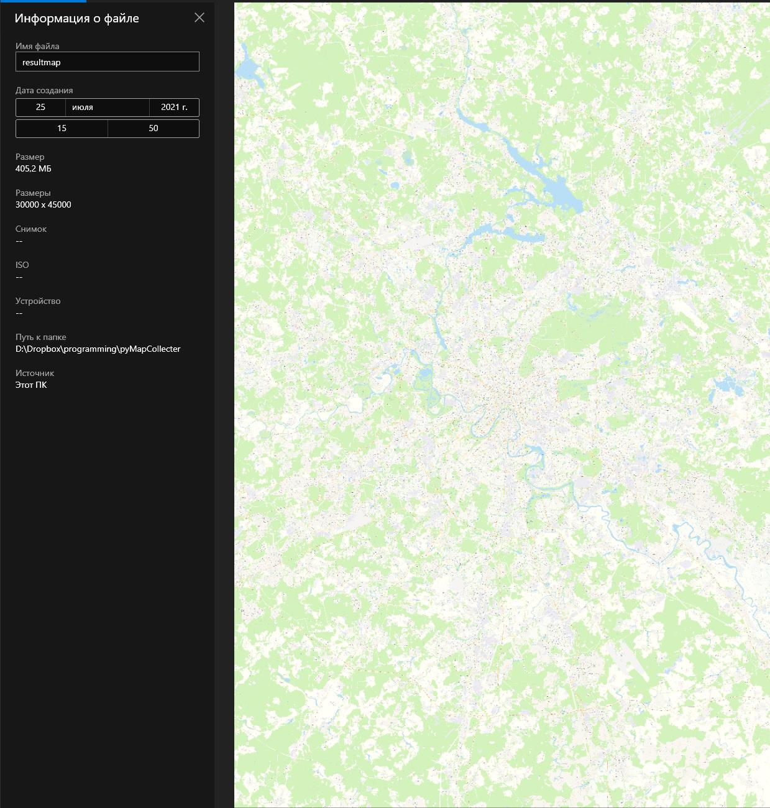
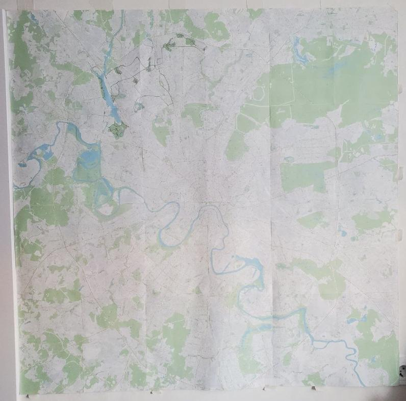

# pythonUnversalMapCollector
Save map to big PNG from any cartographic resource (Yandex.maps, Google Maps etc).

Script automatically moves around the specified area of the map, takes screenshots of small areas and combines them into a large picture.

1. [Parameters](#Parameters)
2. [Dependencies](#Dependencies)
3. [Speed](#Speed)
4. [Bonus](#Bonus)
	[! Note](#!-Note)

## Parameters
You should set:

- `INIT_LINK` - a link to the desired point with the selected scale.
- `SCREENSHOOT_WIDTH`, `SCREENSHOOT_HEIGHT` - size of the final image.
- `SCREENSHOOT_self_boundSize` - save zone for screenshoot. Different services have different safe zones. This depends on the browser window size and map controls location.

Example:
```Python
INIT_LINK = "https://yandex.ru/maps/213/moscow/?ll=37.624027%2C55.753747&z=15.68"

SCREENSHOOT_WIDTH = 30000
SCREENSHOOT_HEIGHT = 45000

SCREENSHOOT_self_boundSize = 500
```

The collector is wrapped in a class `MapCollector`

```Python
MapCollector(
    INIT_LINK,  
    SCREENSHOOT_WIDTH, 
    SCREENSHOOT_HEIGHT, 
    SCREENSHOOT_self_boundSize,
    bodyXpath=params["path"],
    pointIsCenter=True, # point in link center or upper left corner
    controls=params["controls"]
)
```

`controls` - a dictionary with lists of element classes to "close" before collecting. It will be clicked.
`params` - a dictionary with specific constants for services. Example:

```Python
{
    'controls': ["sidebar-toggle-button__icon"], 
    'path': "/html/body"
}
```

## Dependencies
- selenium
- PIL
- io
- tqdm

Also you need `Chrome` and actual version [`Selenium Chrome Driver`](https://chromedriver.chromium.org/downloads)
But you can redo the script for your favorite browser.

## Speed
The map of `30 000` by `45 000` pixels was collected for `2 hours and 35 minutes`.
The final `PNG` weighs `405 MB`.



## Bonus
`cutForPrint.py` - a script for cutting a large image into small ones for printing on paper.
You should to calculate how many pieces you need to cut a map.

###### ! Note 
Epson XP-342 has a print area `20.42 cm` by `28.89 cm` on `A4` . At `300 ppi`, this is `2412 px` by `3412 px`. I do not recommend printing without margins, because you will lose part of the image and will not be able to join the parts.

*My map for tracking cycling trips*
